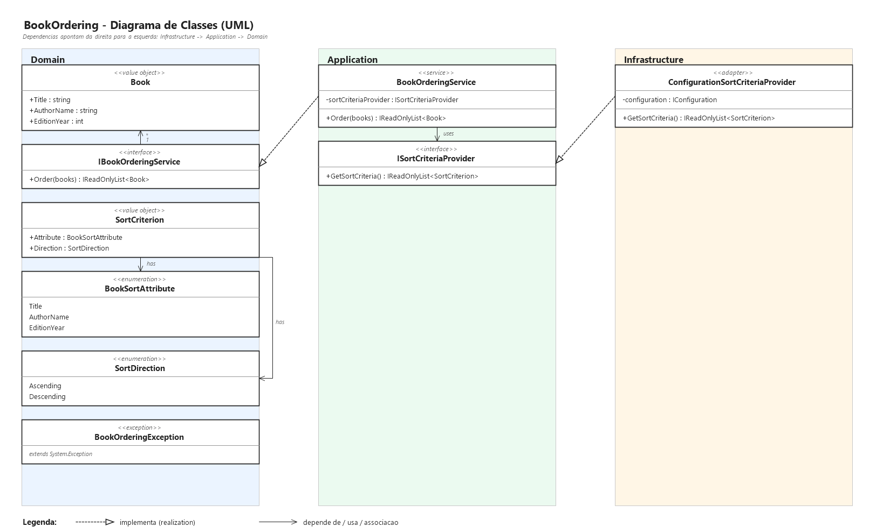

# BookOrdering — Documento de Projeto

Solução da Avaliação Técnica FGV - TIC: um serviço que ordena uma coleção de livros por um
ou mais atributos, cada um com sua própria direção de ordenação, configuráveis por arquivo
sem qualquer alteração de código.

## Visão geral

O caso de uso (`fgv-avaliacao-caso-de-uso.pdf`) define um único ator, o CSO (Cliente do
Serviço de Ordenação), que envia um conjunto de livros e recebe de volta o mesmo conjunto
ordenado. Cada livro é descrito por três atributos — `Title`, `AuthorName`, `EditionYear` —
exatamente como especificado no diagrama de interface original da FGV
(`OrdenacaoLivrosInterface.jpg`, classe `br.fgv::Book`, interface `br.fgv::BooksOrderer`).

O requisito especial do caso de uso é o que efetivamente dirige o projeto: o serviço precisa
suportar **um ou mais atributos de ordenação, cada um com sua própria direção (ascendente ou
descendente)**, e isso precisa ser configurável **por arquivo, sem alteração de código**.

## Arquitetura

A solução segue Clean Architecture, com as dependências apontando sempre para dentro (das
camadas externas para o Domain):

```
Infrastructure  --->  Application  --->  Domain
      |                                     ^
      +------------- ConsoleApp ------------+
```

| Camada | Projeto | Responsabilidade |
|---|---|---|
| Domain | `BookOrdering.Domain` | Regras e contratos centrais: `Book`, `IBookOrderingService`, `SortCriterion`, `BookSortAttribute`, `SortDirection`, `BookOrderingException`. Não depende de nenhuma outra camada. |
| Application | `BookOrdering.Application` | Caso de uso `BookOrderingService`, que orquestra a ordenação combinando os critérios (obtidos via a porta `ISortCriteriaProvider`) com as regras de comparação. Depende só de Domain. |
| Infrastructure | `BookOrdering.Infrastructure` | Adaptador `ConfigurationSortCriteriaProvider`, que implementa `ISortCriteriaProvider` lendo de um arquivo de configuração (`Microsoft.Extensions.Configuration`). Depende de Domain e Application. |
| Apresentação | `BookOrdering.ConsoleApp` | Composition root: liga as três camadas via injeção de dependência manual e demonstra o fluxo completo. Não é o entregável avaliado — ver seção *Escopo* abaixo. |
| Testes | `BookOrdering.Tests` | Suíte xUnit que implementa todos os casos de `fgv-avaliacao-caso-de-teste.pdf`. |

Essa separação garante o requisito de **Desacoplamento** das instruções da FGV: a forma como
os critérios são lidos (hoje, um arquivo JSON) é um detalhe de `Infrastructure`, escondido
atrás da porta `ISortCriteriaProvider` — trocar a fonte de configuração não afeta `Domain`
nem `Application`.

## Diagrama de classes UML



**Domain**

- `Book` — value object imutável (record) com `Title`, `AuthorName`, `EditionYear`; valida no
  construtor que os textos não sejam vazios e que o ano seja positivo.
- `IBookOrderingService` — o contrato público do serviço (`Order(books)`), correspondente à
  interface `BooksOrderer` do diagrama original da FGV.
- `SortCriterion` — par `(Attribute, Direction)`; uma lista ordenada de critérios expressa uma
  ordenação multi-nível completa.
- `BookSortAttribute` / `SortDirection` — enumerações dos atributos ordenáveis
  (`Title`, `AuthorName`, `EditionYear`) e das direções (`Ascending`, `Descending`).
- `BookOrderingException` — lançada quando a coleção recebida é `null`.

**Application**

- `BookOrderingService` — implementa `IBookOrderingService`; recebe `ISortCriteriaProvider`
  por injeção de construtor e combina os critérios numa única função de comparação.
- `ISortCriteriaProvider` — porta que devolve a lista de critérios a aplicar; a única
  dependência externa do caso de uso, isolada por inversão de dependência (SOLID/DIP).

**Infrastructure**

- `ConfigurationSortCriteriaProvider` — implementa `ISortCriteriaProvider` lendo a seção
  `BookOrdering:SortCriteria` de um `IConfiguration`.

## O requisito especial: critérios configuráveis sem alterar código

Cada aplicação host (hoje, só `BookOrdering.ConsoleApp`) declara os critérios em
`appsettings.json`:

```json
{
  "BookOrdering": {
    "SortCriteria": [
      { "Attribute": "Title", "Direction": "Ascending" },
      { "Attribute": "AuthorName", "Direction": "Ascending" }
    ]
  }
}
```

`ConfigurationSortCriteriaProvider` usa o `ConfigurationBinder` padrão do .NET para ligar essa
seção diretamente ao record `SortCriterion` do Domain — o binder do .NET 10 suporta ligação
por construtor em records, então não é necessário nenhum DTO intermediário. Trocar atributos
ou direções, ou adicionar um terceiro critério de desempate, é só editar o JSON; nenhuma
linha de código muda.

## Como a ordenação é implementada

`BookOrderingService.Order` combina, em ordem, todos os `SortCriterion` recebidos numa única
`Comparison<Book>`: cada critério só decide o resultado se todos os critérios antes dele
empataram (tie-break em cadeia). A comparação por atributo usa exclusivamente recursos padrão
do .NET — `string.CompareOrdinal` para texto e `int.CompareTo` para o ano — combinados com
`List<T>.Sort`, sem nenhum algoritmo de ordenação próprio.

`string.CompareOrdinal` foi escolhido deliberadamente em vez da comparação sensível a cultura
usada por padrão em `string.CompareTo`: o resultado da ordenação precisa ser o mesmo
independente do locale da máquina que executa o serviço — importante porque o gabarito de
teste da FGV (`fgv-avaliacao-caso-de-teste.pdf`) define uma saída exata e determinística.

## Decisões de projeto e justificativas

- **Nomenclatura em inglês em todo o código.** Decisão do usuário, aplicada de forma
  consistente em classes, membros, arquivos de configuração e testes.
- **`BooksOrderer`/`br.fgv` (nomes do diagrama original) → `IBookOrderingService` /
  `BookOrderingService`.** O verbo `order()` e o nome conceitual vêm do diagrama fornecido
  pela FGV; o sufixo `Service` foi adicionado por decisão conjunta para deixar explícito, já
  no nome, que a implementação é um Application Service (caso de uso) — sem essa marcação, o
  papel arquitetural da classe não ficava óbvio à primeira vista.
- **`Book` como Value Object imutável**, não Entity: não tem identidade própria além dos seus
  três atributos, então dois livros com os mesmos dados são o mesmo livro para efeitos de
  igualdade — uso direto de `record` do C#, sem necessidade de código extra.
- **Sem container de injeção de dependência no `ConsoleApp`.** A composição é feita à mão
  (`new BookOrderingService(new ConfigurationSortCriteriaProvider(configuration))`) porque um
  container adicionaria uma dependência e uma camada de indireção sem benefício real para uma
  aplicação de demonstração com três serviços.
- **Sem persistência, sem interface visual, sem WebService/API.** Confirmado explicitamente
  pelo e-mail de instruções da FGV (distinto dos PDFs anexos): "o teste não aborda questões
  de persistência de dados... não implementar [interface visual]... construção de um serviço,
  apenas como componente de implementação da solução, não tratar a questão como WebService ou
  Api." O `ConsoleApp` existe só como demonstração executável do fluxo completo — não é uma
  API nem uma interface interativa, e não é o artefato principal avaliado.
- **.NET 10 (LTS)** como plataforma alvo — versão de produção da Microsoft disponível na
  máquina de desenvolvimento no momento da implementação, atendendo ao requisito de rodar
  "em uma versão de produção (não desenvolvimento) da plataforma .Net da Microsoft".

## Estratégia de testes

`BookOrdering.Tests` (xUnit) implementa, um a um, os cenários de
`fgv-avaliacao-caso-de-teste.pdf`, usando os mesmos quatro livros do enunciado
(`Book1`..`Book4`) e um `StubSortCriteriaProvider` de teste para injetar critérios sem
depender de arquivo de configuração:

| Critérios | Saída esperada | Teste |
|---|---|---|
| Título asc, Autor asc | Livros 3, 4, 1, 2 | `Order_ByTitleAscendingThenAuthorNameAscending_ReturnsBooks3421` |
| Autor asc, Título desc | Livros 1, 4, 3, 2 | `Order_ByAuthorNameAscendingThenTitleDescending_ReturnsBooks1432` |
| Edição desc, Autor desc, Título asc | Livros 4, 1, 3, 2 | `Order_ByEditionYearDescendingThenAuthorNameDescendingThenTitleAscending_ReturnsBooks4132` |
| Coleção nula | `BookOrderingException` | `Order_NullBooks_ThrowsBookOrderingException` |
| Coleção vazia | Lista vazia | `Order_EmptyBooks_ReturnsEmptyList` |

Além disso, `ConfigurationSortCriteriaProviderTests` prova, com uma configuração em memória,
que o binding real do `appsettings.json` para `SortCriterion` funciona — validando de ponta a
ponta o requisito de configuração sem alteração de código. `BookTests` cobre as validações do
value object `Book`.

## Como executar

A partir de `src/`:

```
dotnet build BookOrdering.slnx     # compila os 5 projetos
dotnet test BookOrdering.slnx      # roda toda a suíte de testes
dotnet run --project BookOrdering.ConsoleApp   # demonstra o fluxo completo via console
```
